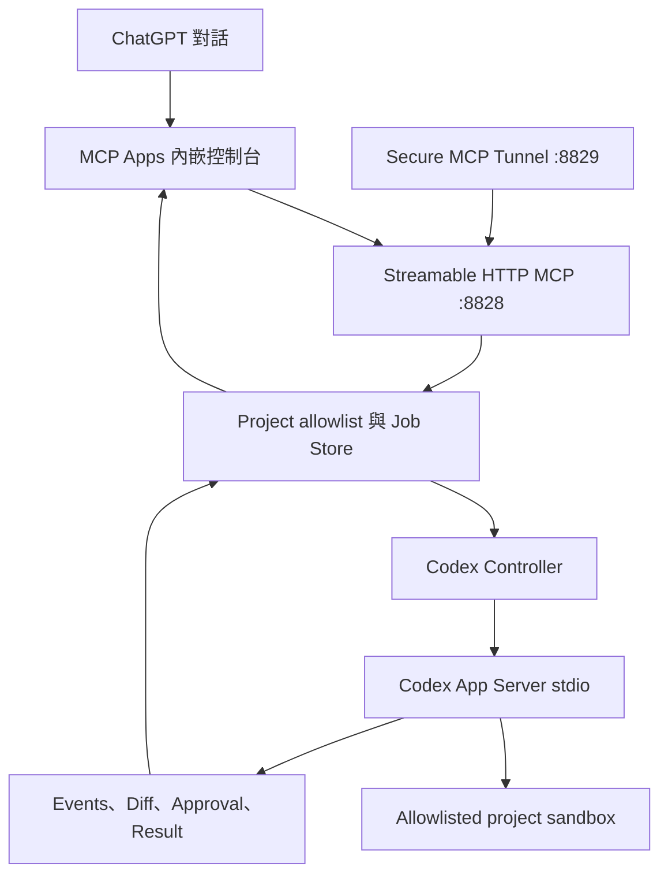

# Codex Handoff Bridge

Codex Handoff Bridge 是私人、allowlist-first 的 MCP Apps 對話工作區。它讓 ChatGPT 將已整理的
工作包交給家中 Windows 主機上的 Codex App Server，並在同一個內嵌介面依專案管理多輪對話、
顯示 Codex 回覆與逐次核准要求。

它不是公司資料政策或封鎖措施的繞過工具。只有個人、公開，或已明確獲准離開公司環境的內容
可以進入這條通道。

## 文件導覽

- [Threat Model](docs/ThreatModel.md)：受保護資產、trust zones、資料分類、攻擊面與剩餘風險。
- [Approval Model](docs/ApprovalModel.md)：preview／dispatch、`plan`／`workspace_write`、
  exact approval 與 restart expiry。
- [Job Recovery](docs/JobRecovery.md)：持久化狀態、interrupted job、artifact、重啟與保留原則。
- [Architecture v1](docs/design/architecture-v1.md)：第一版產品決策、state model 與 non-goals。

## 第一版能力

- MCP Apps 內嵌對話工作區，使用標準 `ui/initialize`、`tools/call` 與 tool-result bridge。
- 左側依 allowlisted project 分組對話，右側顯示使用者與 Codex 的持久化聊天紀錄。
- 同一個 job 可透過 `thread/resume` 與 `turn/start` 繼續既有 Codex thread；執行中的補充訊息使用
  `turn/steer`。
- 模型與推理強度由 App Server `model/list` 動態提供，並與執行模式一起放在輸入框下方。
- `plan` 唯讀與 `workspace_write` 兩種執行模式。
- 輸入框可加入最多 8 份命名純文字文件；Widget 會分段傳送，Bridge 驗證每段與整體 SHA-256、
  UTF-8 大小、MIME、專案及資料分類後，才將內容交給 Codex。
- Codex 不會取得 staging 或 job 目錄權限；Controller 只把驗證後文字內嵌到 turn，runtime workspace
  roots 仍只有 allowlisted project。
- request、final response 與 aggregated diff 會顯示為聊天內成品卡。Widget 按需分段讀取，內容放在
  app-only tool result `_meta`，不會因預覽而自動灌入 ChatGPT transcript。
- 成品可複製；host 支援 MCP Apps `ui/download-file` 時可下載，否則自動改為複製。也可明確送出
  `ui/message`，請 ChatGPT 透過公開讀取工具審核指定成品。
- 只接受 `.local/projects.json` 內的專案 id，不接受 caller 指定任意路徑。
- 每個 job 使用 UUID 目錄，保存 `request.md`、`response.md`、`manifest.json`、`messages.jsonl`、
  `events.jsonl`、`inbox/`、`diff.patch` 與 `result.json`。
- preview digest 與 idempotency key 防止表單變更後誤送或重複建立。
- Codex App Server 提出的 command 與 file change request 逐次核准；不提供 session-wide accept。
- 重啟後不自動重送未完成 turn，舊核准會標成 expired。
- Windows tray、Startup shortcut 與 Secure MCP Tunnel lifecycle。

第一版不提供任意本機路徑、二進位附件、專案檔案瀏覽或雙向目錄同步，也沒有 commit、push、發布、
刪除資料、背景網路存取或自動接受核准的工具。白天整理的工程稿需以受控純文字文件貼入 Widget。

## 架構



Codex App Server 不對外開 listener。只有 Bridge 在本機用 stdio 啟動它；公開入口只能經過既有
Secure MCP Tunnel。

## 安裝與設定

```powershell
cd C:\GPT_MCPtool\codex_bridge
npm install
npm run build
```

把範例複製成 ignored 的本機 allowlist，並只加入確實要交給 Codex 操作的專案：

```powershell
New-Item -ItemType Directory -Force .local | Out-Null
Copy-Item config\projects.example.json .local\projects.json
```

格式如下：

```json
{
  "projects": [
    {
      "id": "omi",
      "name": "Open Market Intelligence",
      "path": "C:\\project\\Open Market Intelligence"
    }
  ]
}
```

路徑必須是現存的絕對目錄。filesystem root、相對路徑、未知 id 與重複 id 會被拒絕。

可選的 `.local/tray-settings.json`：

```json
{
  "projectsFile": "C:\\GPT_MCPtool\\codex_bridge\\.local\\projects.json",
  "dataDir": "C:\\CodexBridge",
  "tunnelId": "tunnel_replace_me"
}
```

`npm install` 會安裝固定版本的官方 `@openai/codex` runtime；Bridge 預設以目前 Node 執行其
`codex.js app-server`，避免 Windows Store App executable 無法由背景 controller spawn 的限制。
Codex 必須在同一個 Windows 使用者下已登入。Bridge 使用現有 Codex 登入，不需要 OpenAI
Platform API key。若要改用其他 CLI，可在本機設定 `codexCommand` 與 JSON 字串形式的 `codexArgs`。

## 本機啟動與托盤

開發模式：

```powershell
npm start
Invoke-RestMethod http://127.0.0.1:8828/health
```

一般托盤入口：

```powershell
.\scripts\Start-Tray.cmd
```

程式更新後，以 exact-path replacement 重載這一個元件：

```powershell
.\scripts\Restart-Tray.cmd
```

托盤使用 `unified-always-on-v2` 契約。正式啟動會一起準備 MCP server 與 Secure MCP
Tunnel；選單不提供 Start／Stop 或 tunnel restart。Jobs folder 保留在 `Exit` 上方的
元件特有區。這只讓外部 MCP 連線能力保持可用，不會替 Codex job 自動開啟 network
access。安裝目前使用者的 Startup shortcut：

```powershell
npm run startup:install
```

### Control Center v3

正式 registry 使用 `control-center/component.json` 與
`scripts/runtime-control.ps1` 管理 Bridge server／tunnel。舊 tray 與 launcher 保留作 rollback；
`scripts/show-diagnostic-tray.vbs` 只在需要時開啟 component-owned diagnostic UI，關閉 UI
不會停止 runtime。

原托盤的 Copy／Open 操作與 Jobs folder 已透過 `component-menu-v1` 直接接回 Control Center
子選單；中樞只委派固定 action ID，不讀 jobs、allowlist、project path、approval 或 tunnel ID。

Codex Bridge 是 `approval-sensitive` 元件。health 若顯示 active job 或 pending approval，
controller 會拒絕 core restart、full reload 與 shutdown，並保持 PID 不變。controller 不讀 job
payload，也沒有 dispatch、turn、steer、cancel 或 approval decision 能力。完整契約與隔離驗證見
[`docs/ControlCenterIntegration.md`](docs/ControlCenterIntegration.md)。

## Secure MCP Tunnel

此元件重用 `project_reading` 已安裝的 `vendor\tunnel-client\tunnel-client.exe` 與目前使用者的
DPAPI control-plane key，但使用自己的 `.tunnel-client\codex-bridge.yaml`、tunnel id、health port
`8829` 與 runtime log。這是 Windows runtime 資源重用，不共享 MCP session 或 job data。

先由 control plane 配發專屬 tunnel id。可將它放入上方 ignored 的
`.local/tray-settings.json`，之後直接執行：

```powershell
npm run tunnel:init
npm run tunnel:doctor
```

也可只在目前 PowerShell session 暫時設定：

```powershell
$env:CODEX_BRIDGE_TUNNEL_ID = "tunnel_replace_me"
npm run tunnel:init
npm run tunnel:doctor
```

不要重用另一個 MCP 元件的 tunnel id。self-test 只回報 ID 是否已設定，不輸出實際值；
profile、DPAPI 密文、log 與 PID 都被 Git 忽略。

## MCP 工具

| 工具 | 權限 | 用途 |
| --- | --- | --- |
| `codex_bridge_status` | read | 主機、allowlist 與最近 job |
| `codex_job_preview` | read | 正規化工作包並產生 digest，不建立 job |
| `render_codex_console` | read/render | 顯示 MCP Apps 對話工作區 |
| `codex_job_get` | read | 讀取 job snapshot 與 bounded events |
| `codex_artifact_get` | read | 讓 ChatGPT 讀取 bounded request、response、diff 或 result |
| `codex_artifact_list` | read | 列出 request、response 與 diff metadata |
| `codex_text_bundle_begin` | app-only action | 建立 server-owned 文字暫存槽 |
| `codex_text_bundle_append` | app-only action | 寫入並驗證單一文字 chunk |
| `codex_text_bundle_finalize` | app-only action | 驗證整體大小、SHA-256 與 secret policy |
| `codex_artifact_read_chunk` | app-only read | 把 bounded 成品 chunk 只送到 Widget `_meta` |
| `codex_job_dispatch` | app-only action | 送出已預覽的工作包 |
| `codex_conversation_send` | app-only action | 對執行中的 turn 補充方向，或續接同一個 Codex thread |
| `codex_job_steer` | app-only action | 對 running turn 補充方向 |
| `codex_job_cancel` | app-only action | 中斷 running turn |
| `codex_approval_decide` | app-only action | 決定單次 command 或 file change 核准 |

`plan` 模式即使收到 file change request 也不能核准。公司資料分類另外要求控制台中的明確授權勾選。
Bridge 會先向 App Server 查詢目前允許的 permission profiles：`plan` 使用 `:read-only`，
`workspace_write` 使用 `:workspace`，且永遠不選擇 `:danger-full-access`。

## 驗證

```powershell
npm test
npm run widget:check
npm run smoke:http
npm run tray:selftest
npm run tunnel:selftest
```

runtime 啟動後再執行：

```powershell
npm run smoke:mcp
npm run doctor:app-server -- "C:\GPT_MCPtool"
```

明確允許消耗一次真實 Codex turn 的唯讀 smoke：

```powershell
npm run smoke:codex -- --confirm-live-codex
```

`smoke:http` 會驗證 15 個工具、9 個 app-only actions、MCP Apps MIME、resource 內容、HTTP bearer
拒絕、文字 staging 完整週期與 preview 不建立 job。它不會啟動實際 Codex turn。

## Runtime 資料

預設資料根目錄是 `C:\CodexBridge`：

```text
C:\CodexBridge\jobs\<job_id>\
  request.md
  response.md
  manifest.json
  messages.jsonl
  events.jsonl
  inbox\
    manifest.json
    <server_generated_artifact_id>.txt
  diff.patch
  result.json

C:\CodexBridge\staging\<bundle_id>\
  manifest.json
  content.txt
  chunks\
```

這些是本機 runtime state，不屬於 source archive。若 server 在 job 未完成時重啟，該 job 會標為
`interrupted`，不會自動再送一次可能有 side effect 的 turn。

## 已知限制

- ChatGPT host 可能快取 tool schema；本機 Restart 後仍可能需要 Refresh Actions 或重新連線。
- Secure MCP Tunnel 必須先有專屬 tunnel id，source code 不會自行建立 control-plane 資源。
- Codex Windows App 套件內的 CLI 若無法由一般終端啟動，需改用同帳號可執行的 Codex CLI，並在
  `.local/tray-settings.json` 設定 `codexCommand`。
- `workspace_write` 中 allowlisted workspace 內的寫入遵循 Codex `:workspace` profile；UI 只會顯示
  App Server 實際提出的核准 request，不保證每個檔案修改前都逐檔停下。需要嚴格 diff-before-apply
  時先用 `plan`，待後續 staged patch workflow 完成後再開放寫入。
- 對話會保存使用者訊息與完成後的 Codex 回覆，但不保存完整 reasoning／token 串流；技術事件仍只保留
  bounded 摘要並寫入後台 log，不在主要聊天介面逐筆顯示。
- 文字文件允許副檔名為 `.txt`、`.md`、`.log`、`.json`、`.yaml`、`.yml`、`.diff`、`.patch`；
  單份最多 500,000 字元／2,000,000 UTF-8 bytes，同一次最多 8 份且合計不超過 2,000,000 bytes。
- 目前不提供跨主機檔案同步、二進位附件上傳、任意輸出檔案掃描或自動清除歷史 staging。
