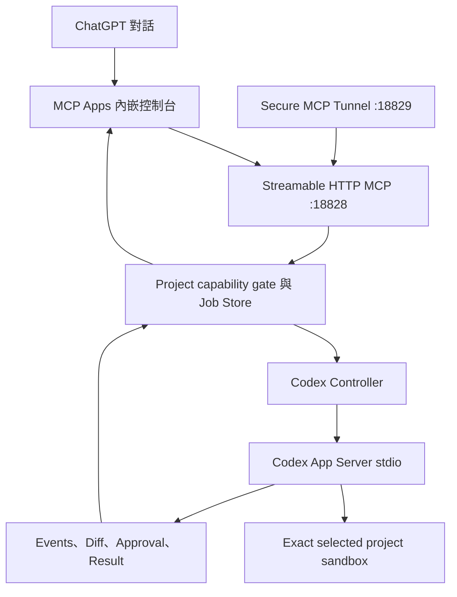

# Codex Handoff Bridge

目前 application release 為 `1.1.0`；MCP Apps、Codex App Server 與 approval contract 仍各自保留相容性邊界。

Codex Handoff Bridge 是私人、allowlist-first 的 MCP Apps 對話工作區。它讓 ChatGPT 將已整理的
工作包交給家中 Windows 主機上的 Codex App Server，並在同一個內嵌介面依專案管理多輪對話、
顯示 Codex 回覆與逐次核准要求。

它不是公司資料政策或封鎖措施的繞過工具。只有個人、公開，或已明確獲准離開公司環境的內容
可以進入這條通道。

## 文件導覽

- [Threat Model](docs/ThreatModel.md)：受保護資產、trust zones、資料分類、攻擊面與剩餘風險。
- [Approval Model](docs/ApprovalModel.md)：preview／dispatch、`plan`／`workspace_write`、
  exact approval 與 restart expiry。
- [Job Recovery](docs/JobRecovery.md)：持久化狀態、interrupted job、artifact、重啟與保留原則。
- [Architecture v1](docs/design/architecture-v1.md)：第一版產品決策、state model 與 non-goals。
- [Conversation Model](docs/ConversationModel.md)：App Server history、live item 投影、cursor、reconnect 與 prompt-neutral input 契約。

## 第一版能力

- MCP Apps 內嵌對話工作區，使用標準 `ui/initialize`、`tools/call` 與 tool-result bridge。
- Fullscreen 使用 Project Ledger 三區工作區：左側依 Codex App Server 的本機歷史分組所有專案與對話，中間保留 user／assistant
  與 approval 敘事，右側集中 plan、command、file change、MCP tool、diff、error 與成品。Opaque cursor 仍可
  分頁載入所有 Bridge conversations。Codex 已保存且通過路徑安全檢查的實際專案可新增、續接與選擇執行模式；
  磁碟根目錄、使用者家目錄、AppData、`.codex`、Downloads 與系統目錄只提供受保護的唯讀歷史。
- Inline 使用 host 提供的完整對話寬度，只顯示目前對話、最近訊息、待核准與最新工作狀態；專案清單改為
  按需覆蓋層，不會持續擠壓 ChatGPT 畫面。Raw reasoning chain-of-thought 不會投影或保存。
- 首次開啟既有 thread 時以 `thread/read(includeTurns=true)` hydrate；之後只接收 durable conversation
  revision patch。Active job 以 900 ms poll 更新，若有分頁待補則以 25 ms catch-up，完成後再回到一般節奏。
- Assistant／plan delta 會更新同一個 item；`item/completed` 是 authoritative final state，不會另外產生
  第二個回覆 bubble。中斷或失敗仍保留已收到的 partial output。
- 同一個 job 可透過 `thread/resume` 與 `turn/start` 繼續既有 Codex thread；執行中的補充訊息使用
  `turn/steer`。
- Initial turn、follow-up 與 steer 只由使用者明確輸入和純資料標記區段組成。Bridge 仍產生
  `request.md` 供稽核，但不再把稽核模板或行為提示送進模型輸入。
- 模型與推理強度由 App Server `model/list` 動態提供，並與執行模式一起放在輸入框下方。
- `plan` 唯讀與 `workspace_write` 兩種執行模式。
- 權限 reviewer 可依對話選擇 `auto_review` 或 `user`；預設自動審核，但 `approvalPolicy`、sandbox、
  network 與目前選定的 exact workspace 不會因此放寬。
- Widget 可透過 MCP Apps 標準 display-mode request 在 inline 與 fullscreen 間切換；inline 寬度跟隨
  host 對話容器，高度以寬度的 1.12 倍等比例計算並限制在 640 至 960 px，只有 host 確認 fullscreen 後才顯示
  Project Ledger 三區工作區。低於 1080 px 時工作紀錄改為抽屜，低於 760 px 時專案清單也改為覆蓋層。
  `night-shift` 暗色主題以黑藍、石墨與低亮度層級銜接 ChatGPT 暗色畫布；Inline 高度不使用 viewport 高度，
  避免 iframe 自動尺寸回授。
- 輸入框可加入最多 8 份命名純文字文件；Widget 會分段傳送，Bridge 驗證每段與整體 SHA-256、
  UTF-8 大小、MIME、專案及資料分類後，才將內容交給 Codex。
- Bridge 會把驗證後文字複製到 ignored 的 `.local/codex-inbox/<job_id>/`，用 server-generated path
  唯讀交給 Codex，並在 turn 保留相同內容的 verified inline fallback。
- Codex 不會取得 staging 或 job 目錄權限；runtime workspace roots 只有目前明確選定且再次驗證的 exact project，
  `codex-inbox` 也不會成為可寫 workspace root。
- request、final response 與 aggregated diff 會顯示在 fullscreen 工作紀錄區。Widget 按需分段讀取，內容放在
  app-only tool result `_meta`，不會因預覽而自動灌入 ChatGPT transcript。
- 成品可複製；host 支援 MCP Apps `ui/download-file` 時可下載，否則自動改為複製。也可明確送出
  `ui/message`，請 ChatGPT 透過公開讀取工具審核指定成品。
- 公開 MCP caller 只接受 `.local/projects.json` 內的專案 id，不接受任意路徑。Widget 可使用 App Server
  thread metadata 發現的 exact project；client 只持有 opaque project id，不能自行提供或改寫 cwd。
- 每個 job 使用 UUID 目錄，保存 `request.md`、`response.md`、`manifest.json`、`messages.jsonl`、
  `events.jsonl`、`conversation.json`、`conversation-events.jsonl`、`inbox/`、`diff.patch` 與 `result.json`。
- preview digest 與 idempotency key 防止表單變更後誤送或重複建立。
- 人工模式下，Codex App Server 提出的 command 與 file change request 逐次核准；自動模式改由
  Codex 原生 reviewer 在相同 sandbox 邊界判斷，不提供 session-wide accept 或 blanket allow。
- 重啟後不自動重送未完成 turn，舊核准會標成 expired。
- Windows tray、Startup shortcut 與 Secure MCP Tunnel lifecycle。

第一版不接受 caller 指定任意本機路徑，也不提供二進位附件、專案檔案瀏覽或雙向目錄同步。App Server
發現的 project 必須是存在的實際目錄並通過敏感路徑 deny rules；只有經過
Widget 驗證的純文字文件會取得固定、唯讀的 `codex-inbox` 路徑。Bridge 也沒有 commit、push、發布、
刪除資料、背景網路存取或自動接受核准的工具。

## 架構



Codex App Server 不對外開 listener。只有 Bridge 在本機用 stdio 啟動它；公開入口只能經過既有
Secure MCP Tunnel。

## 安裝與設定

```powershell
cd C:\GPT_MCPtool\codex_bridge
npm install
npm run build
```

把範例複製成 ignored 的本機 allowlist，並只加入確實要交給 Codex 操作的專案：

```powershell
New-Item -ItemType Directory -Force .local | Out-Null
Copy-Item config\projects.example.json .local\projects.json
```

格式如下：

```json
{
  "projects": [
    {
      "id": "omi",
      "name": "Open Market Intelligence",
      "path": "C:\\project\\Open Market Intelligence"
    }
  ]
}
```

路徑必須是現存的絕對目錄。filesystem root、相對路徑、未知 id 與重複 id 會被拒絕。

可選的 `.local/tray-settings.json`：

```json
{
  "projectsFile": "C:\\GPT_MCPtool\\codex_bridge\\.local\\projects.json",
  "dataDir": "C:\\CodexBridge",
  "tunnelId": "tunnel_replace_me"
}
```

`npm install` 會安裝固定版本的官方 `@openai/codex` runtime；Bridge 預設以目前 Node 執行其
`codex.js app-server`，避免 Windows Store App executable 無法由背景 controller spawn 的限制。
Codex 必須在同一個 Windows 使用者下已登入。Bridge 使用現有 Codex 登入，不需要 OpenAI
Platform API key。若要改用其他 CLI，可在本機設定 `codexCommand` 與 JSON 字串形式的 `codexArgs`。

## 本機啟動與托盤

開發模式：

```powershell
npm start
Invoke-RestMethod http://127.0.0.1:18828/health
```

一般托盤入口：

```powershell
.\scripts\Start-Tray.cmd
```

程式更新後，以 exact-path replacement 重載這一個元件：

```powershell
.\scripts\Restart-Tray.cmd
```

托盤使用 `unified-always-on-v2` 契約。正式啟動會一起準備 MCP server 與 Secure MCP
Tunnel；選單不提供 Start／Stop 或 tunnel restart。Jobs folder 保留在 `Exit` 上方的
元件特有區。這只讓外部 MCP 連線能力保持可用，不會替 Codex job 自動開啟 network
access。安裝目前使用者的 Startup shortcut：

```powershell
npm run startup:install
```

### Control Center v3

正式 registry 使用 `control-center/component.json` 與
`scripts/runtime-control.ps1` 管理 Bridge server／tunnel。舊 tray 與 launcher 保留作 rollback；
`scripts/show-diagnostic-tray.vbs` 只在需要時開啟 component-owned diagnostic UI，關閉 UI
不會停止 runtime。

原托盤的 Copy／Open 操作與 Jobs folder 已透過 `component-menu-v1` 直接接回 Control Center
子選單；中樞只委派固定 action ID，不讀 jobs、allowlist、project path、approval 或 tunnel ID。

Codex Bridge 是 `approval-sensitive` 元件。health 若顯示 active job 或 pending approval，
controller 會拒絕 core restart、full reload 與 shutdown，並保持 PID 不變。controller 不讀 job
payload，也沒有 dispatch、turn、steer、cancel 或 approval decision 能力。完整契約與隔離驗證見
[`docs/ControlCenterIntegration.md`](docs/ControlCenterIntegration.md)。

## Secure MCP Tunnel

此元件重用 `project_reading` 已安裝的 `vendor\tunnel-client\tunnel-client.exe` 與目前使用者的
DPAPI control-plane key，但使用自己的 `.tunnel-client\codex-bridge.yaml`、tunnel id、health port
`18829` 與 runtime log。`18829` 刻意與 MCP 連續埠及常見桌面程式埠分離，並須在啟用前通過
Windows excluded-range、既有 listener 與 workspace port inventory 檢查。這是 Windows runtime
資源重用，不共享 MCP session 或 job data。

Control Center inventory 只讀取 tunnel executable 的 path／version／SHA-256，不做 automatic
upgrade 或切換。Bridge controller 只在 server／tunnel child spawn 時清除 ambient proxy、bypass
`127.0.0.1`／`localhost`，並立即還原 parent environment；需要企業 outbound proxy 時必須改用
明確、component-owned 設定。

先由 control plane 配發專屬 tunnel id。可將它放入上方 ignored 的
`.local/tray-settings.json`，之後直接執行：

```powershell
npm run tunnel:init
npm run tunnel:doctor
```

也可只在目前 PowerShell session 暫時設定：

```powershell
$env:CODEX_BRIDGE_TUNNEL_ID = "tunnel_replace_me"
npm run tunnel:init
npm run tunnel:doctor
```

不要重用另一個 MCP 元件的 tunnel id。self-test 只回報 ID 是否已設定，不輸出實際值；
profile、DPAPI 密文、log 與 PID 都被 Git 忽略。

Lifecycle controller、`scripts/tunnel.ps1` 與 legacy tray rollback 路徑會收集所有非空的 explicit parameter、
`.local/tray-settings.json`、`CODEX_BRIDGE_TUNNEL_ID` 與 profile `tunnel_id`，並要求它們完全一致。
缺漏、非法格式、重複 profile key 或任一來源不一致都會以固定 errorCode fail closed；
`EnsureRunning`／`RepairConnectivity`／`ReloadRuntime` 會在建立或替換程序前停止。Status 與 SelfTest
只輸出來源名稱、數量與一致性狀態，不輸出 identity value。

本機 profile 檢查與遠端 registration 查驗是兩個不同操作：

```powershell
# 純本機；不查外網
npm run tunnel:doctor
powershell -NoProfile -ExecutionPolicy Bypass `
  -File scripts\remote-connectivity.ps1 -Action SelfTest

# 明確的 read-only 外部 lookup；會使用 component-owned runtime key
powershell -NoProfile -ExecutionPolicy Bypass `
  -File scripts\remote-connectivity.ps1 -Action Lookup
```

`Lookup` 使用 15 秒 timeout、64 KiB output 上限與 5 分鐘 evidence TTL。輸出只含
`status`、`checkedAt`、`validUntil`、安全 `errorCode` 與固定 `source`；remote metadata、
tunnel ID、organization／workspace scope、URL、response body 與 credential 不會被投影。
它不代表 ChatGPT connector 已完成 MCP initialize 或工具呼叫。

成功或已分類的 `Lookup` 會以原子替換寫入 component-owned
`.tmp\remote-registration-evidence.json`。`control-center/component.json` 只宣告這個相對路徑；
Control Center Status 讀取限額 8192 bytes，驗證固定 contract／allowlist／TTL，不會執行外部查詢、
載入 runtime key 或讀取 profile。新鮮 `Ready` 會顯示 `readinessScope=remote_registration`，過期後
如實顯示 `Stale`；ChatGPT connector 仍維持獨立的 `NotChecked` 或 E2E 證據。

## MCP 工具

| 工具 | 權限 | 用途 |
| --- | --- | --- |
| `codex_bridge_status` | read | 主機、allowlist 與最近 job |
| `codex_job_preview` | read | 正規化工作包並產生 digest，不建立 job |
| `render_codex_console` | read/render | 顯示 MCP Apps 對話工作區 |
| `codex_job_get` | read | 讀取 job snapshot 與 bounded events |
| `codex_conversation_list` | read | 以 opaque cursor 分頁列出 allowlisted projects 內保存的 Bridge conversations |
| `codex_local_thread_list` | app-only read | 透過 Codex App Server 分頁列出本機 thread metadata；不掃描 `.codex` 檔案 |
| `codex_local_thread_read` | app-only read | 透過 bounded、redacted projection 讀取一筆本機 thread；讀取本身不採用或修改 thread |
| `codex_artifact_get` | read | 讓 ChatGPT 讀取 bounded request、response、diff 或 result |
| `codex_artifact_list` | read | 列出 request、response 與 diff metadata |
| `codex_text_bundle_begin` | app-only action | 建立 server-owned 文字暫存槽 |
| `codex_text_bundle_append` | app-only action | 寫入並驗證單一文字 chunk |
| `codex_text_bundle_finalize` | app-only action | 驗證整體大小、SHA-256 與 secret policy |
| `codex_artifact_read_chunk` | app-only read | 把 bounded 成品 chunk 只送到 Widget `_meta` |
| `codex_job_dispatch` | app-only action | 送出已預覽的工作包 |
| `codex_conversation_send` | app-only action | 對執行中的 turn 補充方向、續接 Bridge thread，或在明確送出時採用安全的本機 thread 後續作 |
| `codex_job_steer` | app-only action | 對 running turn 補充方向 |
| `codex_job_cancel` | app-only action | 中斷 running turn |
| `codex_approval_decide` | app-only action | 決定單次 command 或 file change 核准 |

`plan` 模式即使收到 file change request 也不能核准。公司資料分類另外要求控制台中的明確授權勾選。
Bridge 對所有 turn 保持 `approvalPolicy=on-request`。`auto_review` 只替換 App Server reviewer，
不是提高權限，也可能拒絕高風險操作；`user` 則把實際提出的 request 送回 Widget 逐次決定。
Bridge 啟動 App Server 時會在既有 profile 上加入兩個狹窄的 inline permission profiles：
`plan` 使用繼承 `:read-only` 的 `codex-bridge-read-only`，`workspace_write` 使用繼承 `:workspace`
的 `codex-bridge-workspace`。兩者只額外允許讀取固定的 `.local/codex-inbox`；Bridge 會先用
`permissionProfile/list` 驗證 profile 存在，且永遠不選擇 `:danger-full-access`。

## 驗證

```powershell
npm test
npm run widget:check
npm run smoke:http
npm run tray:selftest
npm run tunnel:selftest
```

runtime 啟動後再執行：

```powershell
npm run smoke:mcp
npm run doctor:app-server -- "C:\GPT_MCPtool"
```

明確允許消耗一次真實 Codex turn 的唯讀 smoke：

```powershell
npm run smoke:codex -- --confirm-live-codex
```

`smoke:http` 會驗證 18 個工具、11 個 app-only actions／reads、MCP Apps MIME、resource 內容、HTTP bearer
拒絕、文字 staging 完整週期與 preview 不建立 job。它不會啟動實際 Codex turn。

## Runtime 資料

預設資料根目錄是 `C:\CodexBridge`：

```text
C:\CodexBridge\jobs\<job_id>\
  request.md
  response.md
  manifest.json
  messages.jsonl
  events.jsonl
  conversation.json
  conversation-events.jsonl
  inbox\
    manifest.json
    <server_generated_artifact_id>.txt
  diff.patch
  result.json

C:\CodexBridge\staging\<bundle_id>\
  manifest.json
  content.txt
  chunks\

C:\GPT_MCPtool\codex_bridge\.local\codex-inbox\<job_id>\
  manifest.json
  <server_generated_artifact_id>.<validated_text_extension>
```

這些是本機 runtime state，不屬於 source archive；`.local/codex-inbox` 由 Bridge 自動建立，且受 repo
根目錄 `.gitignore` 保護。若 server 在 job 未完成時重啟，該 job 會標為 `interrupted`，不會自動再送
一次可能有 side effect 的 turn。

## 已知限制

- ChatGPT host 可能快取 tool schema；本機 Restart 後仍可能需要 Refresh Actions 或重新連線。
- Secure MCP Tunnel 必須先有專屬 tunnel id，source code 不會自行建立 control-plane 資源。
- Codex Windows App 套件內的 CLI 若無法由一般終端啟動，需改用同帳號可執行的 Codex CLI，並在
  `.local/tray-settings.json` 設定 `codexCommand`。
- `workspace_write` 中 allowlisted workspace 內的寫入遵循 Codex `:workspace` profile；UI 只會顯示
  App Server 實際提出的核准 request，不保證每個檔案修改前都逐檔停下。需要嚴格 diff-before-apply
  時先用 `plan`，待後續 staged patch workflow 完成後再開放寫入。
- 目前 live transport 是 MCP tool polling 與 revision cursor，不是 SSE／WebSocket；因此是近即時投影，
  不宣稱與 Codex Desktop 的 frame cadence 或所有私有 UI 完全一致。
- Raw reasoning chain-of-thought 不會保存或顯示；只投影 App Server 明確提供的 user-visible
  reasoning summary。Command output、diff、error 與其他活動內容仍受 bounded storage、redaction 與 UI preview 上限。
- 文字文件允許副檔名為 `.txt`、`.md`、`.log`、`.json`、`.yaml`、`.yml`、`.diff`、`.patch`；
  單份最多 500,000 字元／2,000,000 UTF-8 bytes，同一次最多 8 份且合計不超過 2,000,000 bytes。
- 目前不提供跨主機檔案同步、二進位附件上傳、任意輸出檔案掃描，亦不會自動清除歷史 staging、
  job inbox 或 `codex-inbox`；清理前必須停止 Bridge 並確認沒有執行中的 job。
