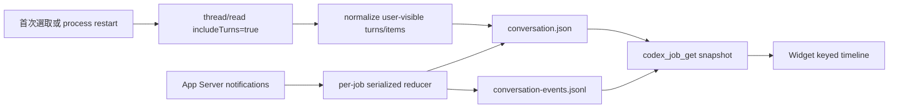

# Codex Bridge Conversation Model

## 目標

Codex Bridge 的對話介面要能回答三件事：目前在哪個專案、做到哪個 turn、Codex 正在做什麼。它必須在
Widget reload、MCP reconnect 或 Bridge process restart 後恢復相同的 user-visible history，同時不把
raw reasoning、任意本機路徑或未授權資料暴露給 client。

## 真相來源

1. Codex App Server thread／turn／item 是 conversation history 的 authoritative source。
2. `conversation.json` 是 Bridge 的 durable、bounded、redacted UI projection；它不是新的 agent runtime。
3. `conversation-events.jsonl` 是 monotonic revision patch log，讓 Widget 不必每 900 ms 重抓整段 history。
4. `messages.jsonl` 保留使用者輸入 metadata、附件摘要與舊版相容，不再獨自代表完整 transcript。
5. `events.jsonl` 是 Bridge 操作／稽核事件；它與 user-visible conversation projection 分開。

## Prompt-neutral input

沒有額外資料時，使用者輸入會原樣送入 App Server，例如：

```text
hello
```

```text
please continue
```

若使用者明確提供 context、acceptance criteria、constraints 或文字附件，Bridge 只增加有名稱的資料區段：

```text
[USER_CONTEXT]
...
[/USER_CONTEXT]
```

文字附件以 `[ATTACHED_TEXT_ARTIFACT]` 保存 filename、MIME、chars、bytes、SHA-256、server-generated
read-only path 與 verified content。這些標記描述資料來源，不加入「必須如何作答」等 Bridge-generated
behavior prompt。`request.md` 是獨立 audit artifact，不作為 `turn/start` input。

## Hydration 與 live reduce



- `thread/read(includeTurns=true)` 只在首次 hydrate、Bridge restart 後或明確 reconciliation 使用，不是
  每次 poll 的資料源。
- Live delta 以 stable item id 更新原項目；`item/completed` 取代同 item 的暫態內容。
- Interrupted／failed turn 會停止 streaming indicator，但保留 partial assistant／command output。
- 同一個 job 的 notification、approval 與 synthetic lifecycle event 依序處理，避免 race 造成 revision 倒退。

## User-visible item allowlist

| App Server / Bridge item | Widget 呈現 | 保存原則 |
| --- | --- | --- |
| user message | 使用者 bubble | 文字、context、附件 metadata |
| agent message | Codex bubble、streaming cursor | bounded text；completed authoritative |
| plan | 可展開活動卡 | user-visible plan text |
| reasoning summary | 可展開活動卡 | 只限 summary；raw reasoning 排除 |
| command execution | command、cwd、status、bounded output | redacted、bounded |
| file change | path、status、bounded diff preview | redacted、bounded |
| MCP tool call | server/tool、status、bounded progress/result | redacted、bounded |
| turn diff | diff 活動卡 | bounded preview |
| approval | inline exact approval | 僅目前 pending request 可決定 |
| error | error 活動卡 | sanitized message |

未知 item 不會把任意 payload 直接序列化進 UI；只保留安全的 generic activity metadata。

## Cursor 與 reconnect

`codex_job_get` 的 event cursor 與 conversation revision cursor 分開：

- `nextEventSeq`：client 實際收到的最後 event seq。
- `serverLastEventSeq`：server 已保存的最新 event seq。
- `nextConversationRevision`：client 實際收到的最後 conversation revision。
- `serverConversationRevision`：server 已保存的最新 projection revision。
- `hasMore`／`conversationHasMore`：client 是否仍需補頁。

Widget 正常狀態每 900 ms poll；落後時每 25 ms 補 bounded page。Patch 第一個 revision 若不是預期下一筆，
或 client cursor 與 server state 無法連續，server 回傳完整 projection 重新對齊，避免靜默漏訊息。

## 專案與對話範圍

`codex_conversation_list` 使用 opaque cursor 分頁所有保存的 Bridge conversations，可選擇 allowlisted
`projectId` 篩選。Widget 另以 app-only `codex_local_thread_list` 呼叫 Codex App Server `thread/list`，顯示
Codex 已保存的所有非 archived 專案與對話；選取時由 `codex_local_thread_read` 呼叫 `thread/read`，沿用相同的
bounded、redacted user-visible projection。Bridge 不直接掃描 `.codex` database、rollout 或使用者家目錄。

本機 history project 若與 `.local/projects.json` 的 exact path 相符，會與 Bridge job 合併並以 `threadId`
去重。其他 App Server 發現的 cwd 會先經 `realpath`、目錄存在性與敏感路徑 deny rules 檢查；安全的實際
project 只以 opaque `local:<digest>` id 暴露給 Widget，可新增對話，也可在使用者明確送出時把既有 thread
採用為 durable Bridge job 後由 `thread/resume` 續作。單純 list／read 不會採用或修改 thread。

磁碟根目錄、使用者家目錄、Windows／Program Files／ProgramData／AppData、`.codex`、`.ssh`、`.aws`、
`.azure`、Downloads、Bridge runtime state 與 dependency／virtual environment 目錄保持受保護唯讀。
Client 不能提供 raw cwd；每次 dispatch／resume 前會由 server 重新解析 exact project。公開 MCP tools 仍只接受
設定檔 allowlist，完整歷史與 discovered project 操作只存在 app-only Widget 邊界。

`thread/list`／`thread/read` shape 對齊 repo 鎖定的 `@openai/codex` 版本；升級 Codex dependency 時必須重新產生
App Server schema 並跑 controller tests，不把 ChatKit Threads API 視為同一份 contract。

## Transport 邊界

本版採 MCP tool polling，目標是 reliable reconnect 與 durable progress，而不是複製 Codex Desktop 的私有
render cadence。未來可在相同 revision contract 上加入 authenticated SSE；SSE 只改 delivery transport，
不改 Job Store、allowlist、sandbox、approval 或 prompt-neutral input 邊界。
