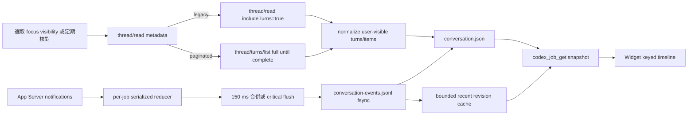

# Codex Bridge Conversation Model

## 目標

Codex Bridge 的對話介面要能回答三件事：目前在哪個專案、做到哪個 turn、Codex 正在做什麼。它必須在
Widget reload、MCP reconnect 或 Bridge process restart 後恢復相同的 user-visible history，同時不把
raw reasoning、任意本機路徑或未授權資料暴露給 client。

## 真相來源

1. Codex App Server thread／turn／item 是 conversation history 的 authoritative source。
2. `conversation.json` 是 Bridge 的 durable、bounded、redacted UI projection；它不是新的 agent runtime。
3. `conversation-events.jsonl` 是 durable monotonic revision patch log，供 startup recovery／稽核；
   live polling 使用 process-memory recent revision cache，超出 cache 則回完整 Bridge snapshot。
4. `messages.jsonl` 保留使用者輸入 metadata、附件摘要與舊版相容，不再獨自代表完整 transcript。
5. `events.jsonl` 是 Bridge 操作／稽核事件；它與 user-visible conversation projection 分開。

## Workspace UX v2 時間與 UI 投影

- Thread `createdAt` / `updatedAt` 是 native 建立／最後活動時間，無 native 值時僅以已知 turn/item 時間補足；未知可省略。
  `hydratedAt`、freshness check 與 journal `at` 是讀取／觀察時間，不是訊息時間。新 patch 明確帶 `createdAt` / `updatedAt`（未知為 null），舊 patch 仍可 replay。
- Item `timestampSource` 僅區分 `native`、`bridge`、`turn`、`live`，用於避免把舊 checkpoint 的 hydration 時刻當成可靠歷史時間。
  Native `createdAt` / `timestamp` 優先；user 可依 exact `clientMessageId` 使用 durable message.at；否則使用 turn.startedAt。
  Assistant 無 native time 時使用 completedAt，再用 startedAt。沒有可靠時間就省略，不讀 hydration clock。
- Live item 的 createdAt 固定，delta/status 僅更新 updatedAt。一般 message UI 只顯示 createdAt，以 zh-TW local time 顯示；跨日帶日期。
  Legacy 無 lineage 的 item clock 在 snapshot 輸出時降為可靠 turn time 或 unknown；native hydration 再校正 checkpoint。
- Native hydration 的內容仍 authoritative，Bridge 僅以 exact identity 補 context/artifact/time/approval metadata；來源已刪除的文字不復活。
  Unified registry 沿用 projection 的 metadata merge，snapshot 與 delta 皆補 durable metadata。訊息清單與未同步 fallback 維持原有 200 筆上限。
- 單檔 App `chat-workspace-v15.html` 的 rail 搜尋是 client-side；選取、project grouping、protected history 與 bounded scroll 保留。
  Header 區分 requested/executed model，delta 同步 tokenUsage/modelRouting。Token chip 僅比較最近一次用量與已知模型視窗，不宣稱 current context pressure。
- Fullscreen Workstream 依 turn 顯示技術活動、成功、真實失敗、已恢復與非零待處理數，另保留 duration / 可用 tokens；
  成功只計 completed 且無 error、非 streaming 的 technical items，command 還須 exitCode=0；未知結果不補成成功。
  已恢復是失敗的子集，不修改 item.status/error，也不改 App Server / JobStore 真相。
- 前端 `turnFailurePresentation` 共用於主對話、Workstream 與 inline。Recovery 只認同 turn 內後續已確認成功：
  MCP 必須同 server/tool；command 必須 exact command 與相同 cwd；fileChange 必須非空 failed path set 全被單一 later success 覆蓋。
  缺失、redacted / truncated identity、跨 turn、error/diagnostic 無可靠 identity，以及 declined/expired/interrupted/cancelled 不推定 recovered。
- Completed turn/job 的一般技術失敗歸 historical，留在預設折疊的技術活動；recovered 卡用中性 secondary badge，原始「失敗」status 仍保留。
  Current turn 使用 job.turnId，找不到時取最後 turn。Active current turn 的最新 failure 若後面沒有確認成功或進行中的其他工作，維持 unresolved；
  其他工作有進展只能使它成 historical，不能稱 recovered。無 operation identity 的 active error 保守維持 unresolved。
  Failed/interrupted/declined/cancelled job 的 current turn 保留最新未恢復 failure 與 error，包含 turn 已 completed 的狀態組合。
  Pending/declined/expired approval 不參與 transient recovery，核准沿用主對話 owner；unresolved 技術活動在 Workstream 預設展開。
- Inline 選最後一個有 narrative 的 turn，保留全部 user/agent entries，再加 approval/active work；recovered/historical failure 不插入 narrative。
  Unresolved failure 最多一張有操作 label 的 compact warning，額外項目以待處理數提示放大查看。缺少公開原因時用中性說明，不讀取 raw error.data。
- Operator drawer 僅在 fullscreen 明確開啟時讀 usage/runtime/inventory，single-flight、30 秒 cache、手動刷新至少間隔 5 秒；render/job polling 不觸發這三個 tools。
  分項 available/unavailable/error 保留；只 render safe selected fields，未知不轉成零。Native dialog 提供 focus containment、Escape 與返回 opener。
- Review/Compact 由 click 觸發，以 exact job/thread/turn 及新 requestId 呼叫既有 direct action。
  JobStore 的 `directActionHistoryEligible` 只投影既有 history classification 規則，UI 再檢查 terminal/idle/pending approval；Controller 仍是 action precondition owner。
  同一 identity 的 receipt 留在 App session，ambiguous delivery 不換 ID 自動重試。Accepted 後回既有 polling/history，不推定完成。
- Sticky 各 column controls；主聊天維持垂直閱讀。只有 artifact/額度小卡可橫向 proximity snap。新 keyed message 160ms/6px reveal 一次，已看過不重播；reduced-motion 停用 animation、smooth scroll 與 snap。

## Shared App Server ownership

`BridgeRuntime` 建立一個 component-owned `CodexAppServerClient`，由它啟動一個 shared App Server child
process；所有 Bridge thread 與 turn 都共用這個 process。App Server PID 不代表任何單一 thread，停止或
kill 該 PID 是整個 Codex Bridge 的 shutdown／restart，會使其他 active turns 一起中斷。

單一工作取消只能由 controller 以 exact `threadId`／`turnId` 呼叫 `turn/interrupt`。Active job 或 pending
approval 期間的 component restart 仍由 approval-sensitive lifecycle guard 拒絕；不得用直接
`Stop-Process`、per-thread PID 假設或第二套 process manager 繞過此邊界。Shared stderr 若沒有 thread identity，
在多個 turn 同時 active 時也不得任意歸到其中一個 job。

## Checkpoint 與 journal recovery

- Revision 先 append 到 `conversation-events.jsonl` 並完成 file sync，才允許更新 process memory；checkpoint
  promotion 失敗時該 revision 仍可重播，且後續 revision 會先修復 pending checkpoint。
- Streaming pending projection 是尚未提交的獨立記憶體狀態，約 150 ms 合併一次 durable revision；
  `item/completed`、`turn/completed`、approval、error、cancel 與其他非 streaming 事件立即 flush。
  此 timer 是排程目標，不是磁碟阻塞下的延遲保證。Widget 只接收已 fsync 的 revisions，不會把 pending
  cursor 當成 durable。突然斷電可能失去尚未 flush 的暫態輸出，後續以 native history 校正；不重送 turn。
- Conversation 寫入依 job 分鎖；pending diff 只保存有上限的最新值，flush 時沿用既有 artifact 寫入。
  相同連續 delta 字串仍視為兩次通知，不能以文字相等判定重複。`item/completed` 負責最終內容取代。
- `conversation.json` 只由已完整寫入並驗證的同目錄 temp promotion；Windows `EPERM`／`EEXIST` fallback
  先保留一份已驗證 `conversation.json.bak`，再用 bounded swap 取代 primary，不會 copy 覆寫 active file。
- 啟動時先驗證 primary／backup schema 與 revision，再讀取 journal。Checkpoint 落後時只重播連續缺少
  revisions；identical duplicate 只套用一次，conflicting duplicate、gap 與 middle corruption fail closed。
- 未換行且無法解析的 final JSONL tail 可截回最後完整 byte boundary；已換行的 malformed record 視為
  committed corruption，不會靜默跳過。
- Valid legacy checkpoint 即使沒有 journal 仍可讀取，並 lazy seed 一份 bounded backup。只有 primary、backup
  與 journal 都完全沒有既有證據時，才建立新的空 projection。
- Recovery diagnostics 只包含固定 code、時間與 revision metadata，不包含 transcript、path、secret 或 payload。

Journal compaction／rotation 必須等 verified checkpoint 已涵蓋被移除 revisions，並在 crash 中保留至少一份
可恢復狀態。目前尚未實作，列為 P2 storage/performance debt。

## 補頁與 active recovery

政策集中在 `src/conversation-delivery.ts`：每 job 最多 256 patches／4 MB，全 process hot cache
最多 32 MB；單次 delta response 最多 40 revisions／512 KB。Count/byte 是序列化 payload 預算，
不是 JavaScript heap 的精確上限。落後超過 200 revisions、cursor 不連續、cache miss 或單一 patch
超過 delta 預算時，回傳完整既有 projection，而非掃 journal 或逐頁重播。

`codex_job_get` 保留原參數，新增 optional `recovery: "snapshot" | "native"`：

- `snapshot`：直接讀已提交 Bridge projection，不讀 native history。
- `native`：有 cooldown 與 single-flight 的 active thread 唯讀校正，之後回完整 Bridge snapshot；
  失敗或競態時仍回最後已提交 projection，`conversationRecovery.outcome` 區分 applied／deferred。
- 普通 active poll 在最後通知後 15 秒可啟動校正，每 job 至少間隔 30 秒。

Native 讀取不持有 notification lock。套用前核對 ingress epoch、durable revision、threadId 與 turnId；
讀取期間有新通知（包括仍排隊的通知）、cancel 或 approval 時，不套用舊 native snapshot。Native history
缺少 active turn 也不能清空 projection。若 native 明確顯示原 turn 已完成，則修復漏掉的 terminal state，
仍不新增 user message、resume 或 turn/start。持續輸出造成 snapshot 一直變動時會延後 native 校正，
client backlog 則仍可立即用 Bridge snapshot 恢復。

Widget 超過 server 回傳的 1.5 秒／4 頁補頁預算、MCP call 失敗或 visibility restore 時改取 snapshot。
單一 poll flight、selection generation、monotonic cursor 與 patch continuity guard 防止舊回應覆蓋
新對話。`conversationDelivery` 回報 lag、pending、flushFailed、inputNotifications、durableCommits
與 hot cache bounds；`conversationRecovery` 只含時間、固定 outcome 及 unmatched notification count，
不輸出 transcript 或原始 notification payload。

本次維持既有 MCP Apps `tools/call` 與 tool-result bridge：
[官方 MCP server 文件](https://developers.openai.com/plugins/build/mcp-server)、
[官方 Widget 文件](https://developers.openai.com/plugins/build/chatgpt-ui)。

## Prompt-neutral input

沒有額外資料時，使用者輸入會原樣送入 App Server，例如：

```text
hello
```

```text
please continue
```

若使用者明確提供 context、acceptance criteria、constraints 或文字附件，Bridge 只增加有名稱的資料區段：

```text
[USER_CONTEXT]
...
[/USER_CONTEXT]
```

文字附件以 `[ATTACHED_TEXT_ARTIFACT]` 保存 filename、MIME、chars、bytes、SHA-256、server-generated
read-only path 與 verified content。這些標記描述資料來源，不加入「必須如何作答」等 Bridge-generated
behavior prompt。`request.md` 是獨立 audit artifact，不作為 `turn/start` input。

## Hydration 與 live reduce


```mermaid
flowchart LR
    A[選取 focus visibility 或定期核對] --> B[thread/read metadata]
    B -->|legacy| C1[thread/read includeTurns=true]
    B -->|paginated| C2[thread/turns/list full until complete]
    C1 --> C[normalize user-visible turns/items]
    C2 --> C
    C --> D[conversation.json]
    E[App Server notifications] --> F[per-job serialized reducer]
    F --> W[150 ms 合併或 critical flush]
    W --> G[conversation-events.jsonl fsync]
    G --> D
    G --> R[bounded recent revision cache]
    D --> H[codex_job_get snapshot]
    R --> H
    H --> I[Widget keyed timeline]
```

- Reader 不以 exception 猜 protocol；先依 metadata 的 `historyMode` 分流。Paginated history 必須取得全部
  cursor pages，並固定要求 `itemsView="full"`；任何頁失敗、cursor loop、重複 turn 或安全上限超出都不覆蓋
  最後一次已驗證 projection。
- App Server history 會完整讀取；送往 Widget 的 bounded projection 使用 2,000,000 字元總文字預算，且每筆
  command output 最多 2,000 字元。超限時保留 item identity／status、優先保留較新的 user-visible narrative，
  並以 `native_projection_bounded` 明示 UI 技術輸出已縮限；原始 native history 不會被修改。
- Paginated full read 前後會各取一次 metadata/head fingerprint。中途新增或變更 turn 時完整重試一次；第二次仍不一致
  以 `HistoryChangedDuringRead` fail closed。到達 `maxTurns` 且仍有 cursor 時直接回 `HistoryLimitExceeded`，不送出 `limit=0`。
- Fingerprint 變更或週期 full-read 到期才抓完整 history；成功 hydration 是 authoritative replacement，來源已移除
  的 turn/item 會透過 `replaceAll` revision patch 從 Widget 刪除。
- App Server user message text 永遠是內容權威。`messages.jsonl` 只有在 App Server `clientId` 與 Bridge
  `clientMessageId` 完全一致時才附加 context／input artifact metadata；不使用 positional fallback，也不重建已由來源刪除的訊息。
- Live delta 以 stable item id 更新原項目；`item/completed` 取代同 item 的暫態內容。
- Interrupted／failed turn 會停止 streaming indicator，但保留 partial assistant／command output。
- 同一個 job 的 notification、approval 與 synthetic lifecycle event 依序處理，避免 race 造成 revision 倒退。
- Widget 以 `data-timeline-key` 做 incremental reconciliation；append、remove、reorder 只新增、移除或移動
  對應節點，signature 變更只替換該節點並保留 `details.open`。正常 poll 不重建整段 transcript，既有節點的
  action 使用一次性 event delegation，避免重用節點時累積 click handler。

## User-visible item allowlist

| App Server / Bridge item | Widget 呈現 | 保存原則 |
| --- | --- | --- |
| user message | 使用者 bubble | 文字、context、附件 metadata |
| agent message | Codex bubble、streaming cursor | bounded text；completed authoritative |
| plan | 可展開活動卡 | user-visible plan text |
| reasoning summary | 可展開活動卡 | 只限 summary；raw reasoning 排除 |
| command execution | command、cwd、status、bounded output | redacted、bounded |
| file change | path、status、bounded diff preview | redacted、bounded |
| MCP tool call | server/tool、status、bounded progress/result | redacted、bounded |
| turn diff | diff 活動卡 | bounded preview |
| approval | inline exact approval | 僅目前 pending request 可決定 |
| error | error 活動卡 | sanitized message |

未知 item 不會把任意 payload 直接序列化進 UI；只保留安全的 generic activity metadata。

## Cursor 與 reconnect

`codex_job_get` 的 event cursor 與 conversation revision cursor 分開：

- `nextEventSeq`：client 實際收到的最後 event seq。
- `serverLastEventSeq`：server 已保存的最新 event seq。
- `nextConversationRevision`：client 實際收到的最後 conversation revision。
- `serverConversationRevision`：server 已保存的最新 projection revision。
- `hasMore`／`conversationHasMore`：client 是否仍需補頁。

Active Bridge job 正常狀態每 900 ms poll；落後時每 25 ms 補 bounded page。Terminal thread 每 20 秒核對，
active automation target 每 4 秒核對，focus／visibility 回復時立即 refresh；後兩者先比對 metadata fingerprint，
未變更時沿用 process 內最後一份已驗證 native snapshot，不重讀完整 history。Patch 第一個 revision 若不是預期下一筆，
或 client cursor 與 server state 無法連續，server 回傳完整 projection 重新對齊，避免靜默漏訊息。

Focus 與 visibility 共用同一個 full-registry single-flight coordinator。每次新 full refresh 取得 monotonic
generation；只有 current generation 可以修改 conversations、cursor 與 diagnostics，stale response 直接丟棄。
Cursor load-more 會等待 full refresh、綁定當下 generation／cursor，且永遠 merge-only，不具有 replace authority。

## 專案與對話範圍

Server-side unified registry 以 App Server `thread/list` 為 native inventory，依 `threadId` 合併 Bridge JobStore
與 automation overlay；同一 thread 永遠只回一筆 summary，native title／recency 是顯示基準，Bridge job 保留
執行狀態與成品，automation 只加入名稱、狀態、schedule、target id 與時間。Widget 不再自行決定兩份清單的
precedence。Bridge 不掃描 `.codex` database 或 rollout；automation adapter 只讀 `%CODEX_HOME%\\automations\\*\\automation.toml`
的 allowlisted keys，限制 path、檔案大小與 parse failure，絕不讀取或回傳 prompt。

Native inventory 與 automation adapter 使用獨立 failure boundary；其中一方失敗時仍回傳另一方與 durable Bridge jobs，
並附上 bounded diagnostics。Conversation `updatedAt` 不混入 automation 設定時間，automation 時間另放
`automationUpdatedAt`。Inventory 會沿 App Server cursor chain 讀取，顯式安全上限為 10,000；超過時標示 incomplete。
Registry 只在 native inventory 成功、complete 且為 first page 時回 `reset=true`。Unavailable、incomplete、truncated
或 cursor page 都是 merge-only；server 會保留上一份 verified native inventory，並讓 durable Bridge／automation
overlay 繼續合併。Widget 即使收到 degraded first page 也不清除既有 conversation。

本機 history project 若與 `.local/projects.json` 的 exact path 相符，會與 Bridge job 合併並以 `threadId`
去重。其他 App Server 發現的 cwd 會先經 `realpath`、目錄存在性與敏感路徑 deny rules 檢查；安全的實際
project 只以 opaque `local:<digest>` id 暴露給 Widget，可新增對話，也可在使用者明確送出時把既有 thread
採用為 durable Bridge job 後由 `thread/resume` 續作。單純 list／read 不會採用或修改 thread。

磁碟根目錄、使用者家目錄、Windows／Program Files／ProgramData／AppData、`.codex`、`.ssh`、`.aws`、
`.azure`、Downloads、Bridge runtime state 與 dependency／virtual environment 目錄保持受保護唯讀。
Client 不能提供 raw cwd；每次 dispatch／resume 前會由 server 重新解析 exact project。公開 MCP tools 仍只接受
設定檔 allowlist，完整歷史與 discovered project 操作只存在 app-only Widget 邊界。

`thread/list`／`thread/read` shape 對齊 repo 鎖定的 `@openai/codex` 版本；升級 Codex dependency 時必須重新產生
App Server schema 並跑 controller tests，不把 ChatKit Threads API 視為同一份 contract。

## Transport 邊界

本版採 MCP tool polling，目標是 reliable reconnect 與 durable progress，而不是複製 Codex Desktop 的私有
render cadence。未來可在相同 revision contract 上加入 authenticated SSE；SSE 只改 delivery transport，
不改 Job Store、allowlist、sandbox、approval 或 prompt-neutral input 邊界。

## Control-plane telemetry

See [Control Plane Contract](ControlPlaneContract.md) for the 0.154.0 notification contract.
`conversation.tokenUsage` and per-turn `tokenUsage` retain total/last/modelContextWindow without estimating missing values.
`modelRouting` distinguishes the requested model from the native reroute destination, retains its reason and exact turn id,
and survives journal replay, hydration and unified native-history reads. Existing `job.model` remains a requested/configured model.
Inline review entered/exitedReviewMode content is preserved in the existing conversation projection.
